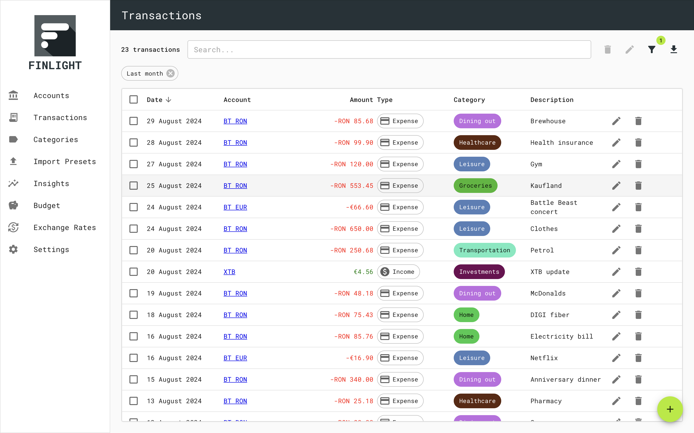
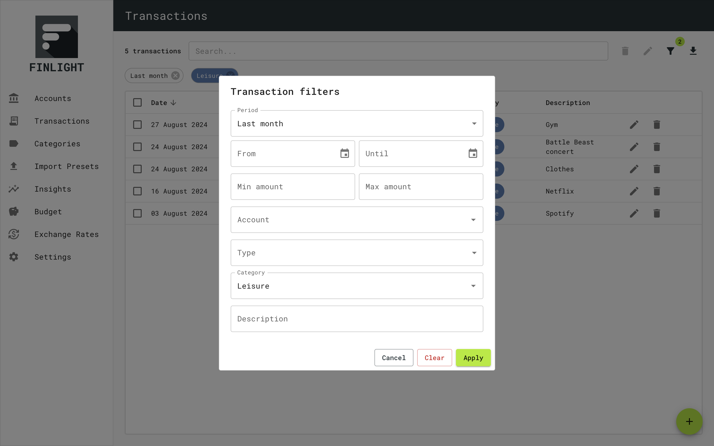
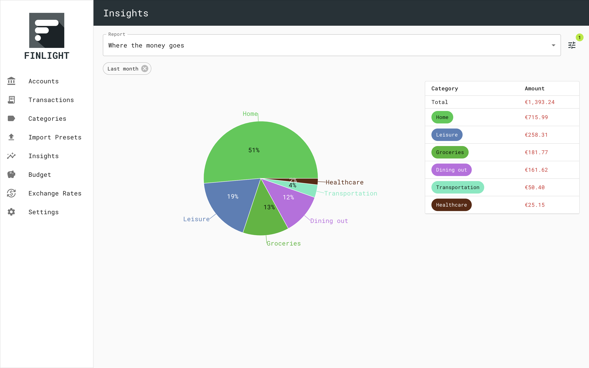
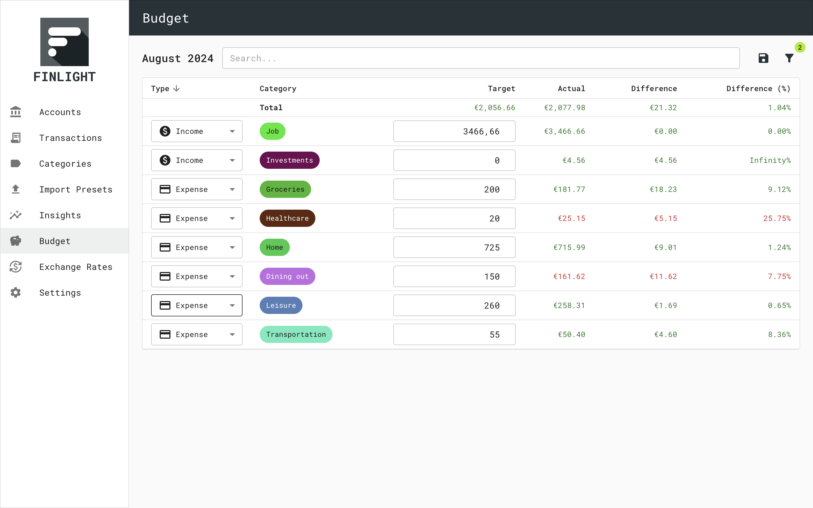
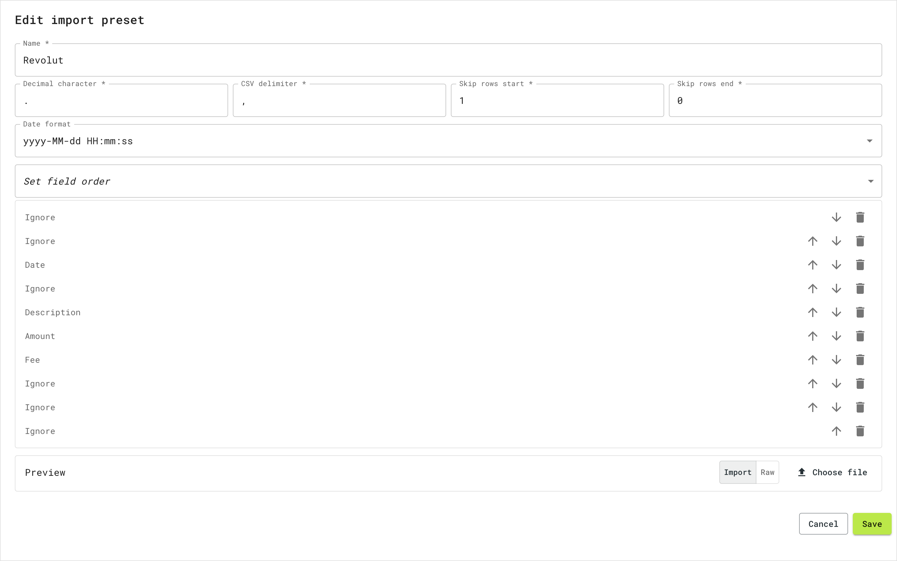
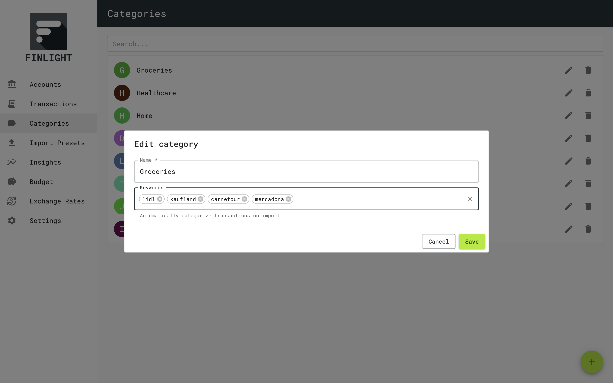
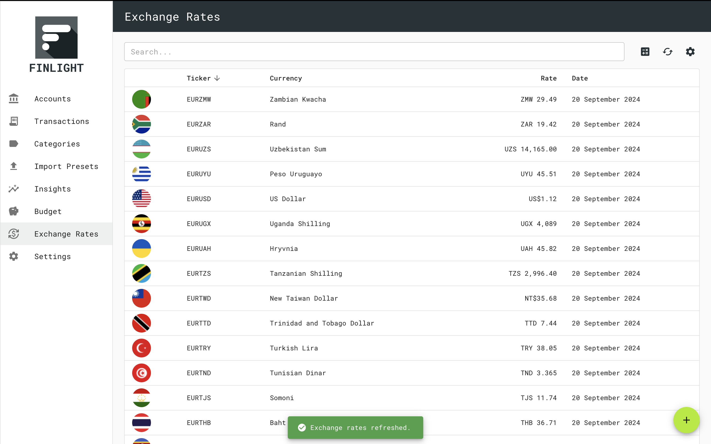

# Finlight

Finlight is a simple personal finance app.

## Features

- 🔐 Local and privacy first, you 100% own your data.
- 🏦 Multi-account.
- 💱 Multi-currency support with currency normalisation.
- 💸 Track income, expenses and account transfers (double-entry).
- 📊 Insights.
- 💰 Budgeting.
- 🙌 Cross platform: Linux, Windows and Mac.

## Technologies

- 🖥️ [Electron](https://www.electronjs.org/)
- ⚛️ [React](https://react.dev/)
- 🔄 [tRPC](https://trpc.io/)
- 📋 [Material UI](https://mui.com/material-ui/)
- 📚 [SQLite 3](https://www.sqlite.org/)
- 🔍 [Kysely](https://kysely.dev/)
- 📊 [Recharts](https://recharts.org/en-US/)
- 🛣️ [React Router](https://reactrouter.com/en/main)

## Getting started

Clone the repo

```
git clone git@github.com:dsaltares/finlight-electron.git
```

Install dependencies

```
yarn
```

Run the app

```
yarn start
```

## Screenshots

Check your overall balance normalised to a common currency.


Powerful transaction search with detailed filters.



Visualise where your money goes, where it comes from and track it over time.


Manage your budget on a monthly, quarterly or yearly basis.


Easily create CSV importer for any bank CSV statement format.


Auto-categorise transactions on CSV import via keywords.


Refresh exchange rates via [Polygon.io](https://polygon.io/) with your own API key.


## License

Finlight is licensed under [MIT](./LICENSE).
